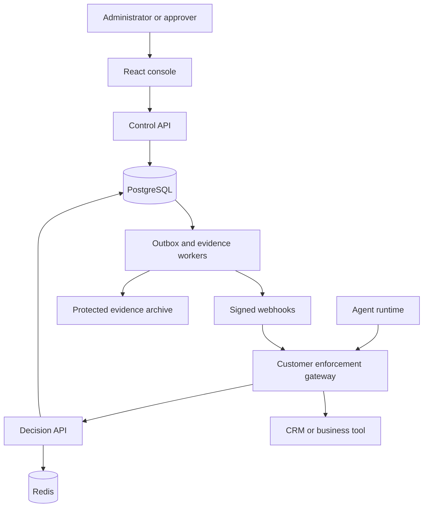
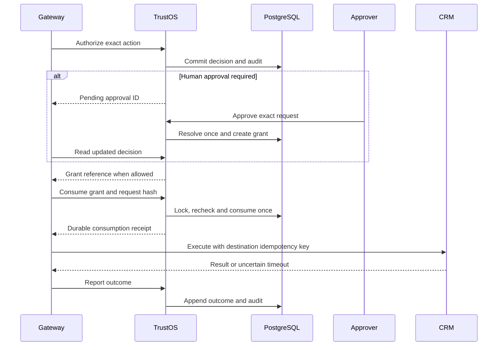
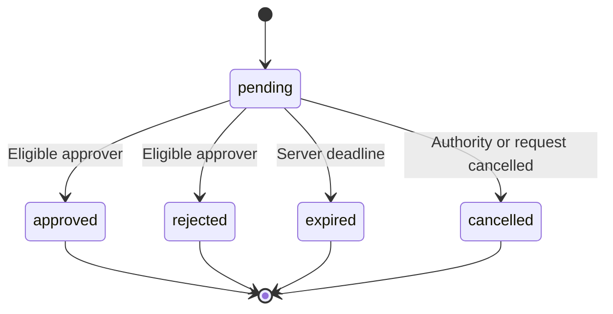

# TrustOS Architecture

| Field | Value |
| --- | --- |
| Version | 1.0 proposed implementation design |
| Date | 20 September 2026 |
| Product requirements | [prd.md](prd.md), v1.1 |
| Audience | Backend, frontend, platform, security and QA engineers |
| Implementation status | Design only; no application or infrastructure is deployed by these files |

## 1. Architecture decision

Start with a TypeScript modular backend, a React console, a deterministic policy package and PostgreSQL as the durable system of record. Build three runnable backend entry points from the same repository: control API, decision API and asynchronous workers. They share versioned domain packages, not network calls for every internal operation.

Redis accelerates rate limits and immutable policy caching. It does not decide whether an approval exists or a grant has been consumed. PostgreSQL transactions own those facts.

The customer-controlled enforcement gateway is a mandatory trust boundary for protected writes. TrustOS decides and records authority; the gateway consumes authority and executes through destination-specific credentials. Agents must not possess alternate direct credentials that bypass that gateway.

### 1.1 Guarantees and limits

- Enforce tenant/environment isolation, deterministic evaluation and a single durable consumption per grant.
- Preserve original decisions, resolution events and outcome evidence.
- Deny consumption after relevant authority/policy changes.
- Fail closed when current authority or durable recording cannot be established.
- Do not claim exactly-once execution across TrustOS and an external SaaS API. That requires destination idempotency or reconciliation.
- Do not claim immutable truth against a fully compromised cloud administrator. Protected checkpoints make specified tampering detectable within documented trust assumptions.
- Do not claim ownership registration verifies legal identity, human skill or agent competence.

## 2. System context



The gateway belongs to the customer/integrator trust domain. Console clients and agent-produced content are untrusted inputs. Public APIs authenticate callers and derive tenancy before accessing data. Webhooks are hints to refresh authenticated state, not bearer authority to execute.

## 3. Stack and deployment units

Versions must be pinned after compatibility/security review at implementation time; this document does not prescribe an unverified latest version.

| Layer | Proposed technology | Responsibility |
| --- | --- | --- |
| Console | React, Vite, TypeScript, MUI, React Hook Form | Registry, policies, approvals, investigations and setup |
| Server state | Query cache library selected at implementation | Paginated reads, mutation invalidation and stale-state handling |
| Backend | NestJS and TypeScript | Validated HTTP contracts and modular services |
| Policy runtime | Pure TypeScript restricted evaluator | Typed, bounded deterministic evaluation without network or LLM calls |
| Transactional store | PostgreSQL, Prisma plus explicit reviewed SQL | State, transactions, indexes, RLS, outbox and concurrency primitives |
| Cache/queue | Redis; BullMQ for dispatch convenience | Rate limiting, immutable cache and retry scheduling |
| Durable job authority | PostgreSQL outbox/delivery tables | Rebuild dispatch after Redis loss; never lose a committed event |
| Object storage | Managed private object store | Encrypted exports, audit segments and protected manifests |
| Identity | Established OIDC/OAuth provider | MFA, sessions and machine-token issuance |
| Secrets/keys | Managed secrets store and KMS | Signing, encryption and webhook-secret rotation |
| Telemetry | OpenTelemetry-compatible collector | Sanitized traces, metrics and operational logs |
| Infrastructure | Terraform or equivalent reviewed IaC | Reproducible environments and permissions |

### 3.1 Repository layout

| Path | Ownership |
| --- | --- |
| apps/console | React UI |
| apps/control-api | Organization, identity, policy, approval and audit HTTP routes |
| apps/decision-api | authorize, decision read, grant consume and outcome APIs |
| apps/worker | Outbox, webhook, expiry, export, integrity and reconciliation jobs |
| packages/domain | Invariants and state transition definitions |
| packages/policy-engine | Schema, compile, evaluate and explanation functions |
| packages/contracts | OpenAPI source, request schemas and event schemas |
| packages/database | Prisma schema, SQL migrations, repositories and tenant transactions |
| packages/auth | Token validation and authorization guards |
| packages/observability | Safe logging and metric helpers |
| packages/sdk-typescript | Public SDK and consumer tests |
| integrations/reference-crm | Trusted gateway adapter and sandbox destination |
| tests/security, tests/load, tests/e2e | Cross-cutting verification |
| infra, docs/runbooks | IaC and operating procedures |

Module boundaries are enforced through import rules. One module owns writes to each table; other modules call its domain interface. Separation into independent services is deferred until measured scaling or ownership needs justify it.

## 4. Domain modules

| Module | Writes/owns | Important invariants |
| --- | --- | --- |
| Tenancy | Organizations, environments, memberships | Authenticated tenant context cannot come from an arbitrary body field |
| Identity | Principals, owners, credential bindings, epochs | Active owner and agent required; revocation terminal |
| Capabilities | Action schemas and scoped grants | Action/resource permissions bound the policy evaluator |
| Policies | Drafts, reviews, versions, environment bundle | Published content immutable; reviewed hash matches publication |
| Decisions | Requests, decision records, idempotency | One original result per scope/key/fingerprint |
| Approvals | Request projections and immutable resolution events | At most one terminal resolution; server-side expiry |
| Enforcement | Execution grants and consumption receipts | One consume per grant; exact audience/request binding |
| Outcomes | Append-only reports and outcome projection | Reports require authorized consumed grant; unknown is not success |
| Evidence | Audit events, outbox and signed manifests | State mutation and durable audit insertion are atomic |
| Delivery | Endpoint configuration, attempts and export jobs | At-least-once delivery with idempotent consumers |

## 5. Authentication and trust boundaries

### 5.1 Human console access

Use the provider's authorization-code flow with PKCE and a backend-for-frontend session. Store provider tokens server-side; expose Secure, HttpOnly, appropriately SameSite cookies. Protect mutations with CSRF and origin checks. Enforce MFA claims and fresh step-up for credential changes, production policy publication and membership administration.

Validate issuer, intended audience, expiry, signature algorithm and key identity. Reject unexpected token types/algorithms. Session membership and privileged permissions are checked against current server state, not just a long-lived token snapshot. Enterprise federation and SCIM remain later features.

Use the established OAuth security guidance as the implementation baseline; avoid designing a new authentication protocol. [OAuth 2.0 Security Best Current Practice](https://www.rfc-editor.org/rfc/rfc9700.html).

### 5.2 Machines and gateway

Use provider-issued short-lived client-credentials tokens for the initial supported provider. TrustOS stores client/principal mappings, credential status and epochs, never recoverable plaintext client secrets. Provision/rotate credentials through the provider integration; expose new secrets only once through a protected flow.

Bind each agent client to one principal and environment. Gateway clients have distinct scopes: authorize for an explicit allowlist of agents, consume grants for their audience, and report outcomes. Never grant an unrestricted `act_as_any_agent` permission.

For gateway-originated evaluation, the gateway authenticates the agent upstream and attests the selected agent ID. TrustOS validates that the gateway may represent that agent. Do not accept arbitrary agent IDs from a broad shared credential. Full cross-organization delegation is out of scope.

An agent may directly evaluate in sandbox, but direct agent credentials cannot consume production write grants. Execution credentials remain at the trusted gateway. Network restrictions and destination IAM must prevent alternate access paths.

### 5.3 Trusted context

Classify attributes by provenance:

| Category | Source | Treatment |
| --- | --- | --- |
| tenant/environment/principal | Validated token and server mappings | Never override from request body |
| assigned regions and capability scope | TrustOS administrative records | Authoritative for authorization |
| customer region/resource revision | Gateway read from permitted destination | Record source and observed_at; enforce freshness |
| purpose/free-text request | Agent/user input | Untrusted; cannot establish access rights |
| model/version metadata | Agent registration | Self-reported unless separately attested |

Schema defines provenance and freshness per required attribute. The decision API does not fetch arbitrary URLs supplied by the agent. If needed data is missing/stale, return a non-executable response. The gateway refetches and resubmits.

## 6. Tenant isolation and schema

### 6.1 Scope model

Organization-level records carry `tenant_id`. Environment-level records carry both `tenant_id` and `environment_id`. Human membership is tenant-level; agent credentials and policy bundles are environment-scoped. Use composite foreign keys so a valid row ID from another tenant/environment cannot be attached accidentally.

Derive scope from authentication. For each Prisma transaction, set trusted tenant/environment context with transaction-local database settings, use that same transaction client for every scoped query, and clear it by ending the transaction. Never use connection-session state with pooled connections.

Apply row-level security to scoped tables using both `USING` and `WITH CHECK`. Application roles must not own the tables, be superusers, or have BYPASSRLS. Use FORCE ROW LEVEL SECURITY as defense in depth where appropriate. Schema migrations use a separate narrowly controlled role. These distinctions matter because PostgreSQL table owners and privileged roles can bypass ordinary RLS. [PostgreSQL row security documentation](https://www.postgresql.org/docs/current/ddl-rowsecurity.html).

Workers obtain tenant scope from authenticated, validated job records and enter the same tenant transaction wrapper. Cross-tenant scheduling uses a separate minimal dispatcher role; processing itself remains scoped. Export and error paths must not leak whether another tenant's ID exists.

### 6.2 Principal tables

| Table | Core fields beyond scope/ID | Constraints/indexes |
| --- | --- | --- |
| organizations | name, status, region, auth_epoch, retention_profile | Stable tenant ID |
| environments | name, mode, status, current_bundle_revision | Unique tenant/name |
| memberships | user_id, role, status, auth_epoch | Unique tenant/user |
| approver_groups | group_key, name, status | Unique tenant/group_key; environment assignments explicit |
| approver_group_members | group_id, membership_id, status | Unique group/member; same-tenant references |
| principals | type, name, owner_membership_id, status, auth_epoch, metadata | Owner scoped to tenant; agent environment required |
| credential_bindings | provider_client_id, principal_id, status, credential_epoch | Unique issuer/client; environment binding |
| capabilities | action_key, resource_type, input_schema_version, schema | Unique tenant/environment/action_key |
| capability_grants | principal_id, action_key, constraints, revision, status | Tenant/environment composite references |
| policy_versions | policy_id, version, content, hash, author_id, created_at | Unique policy/version; immutable after publish |
| policy_reviews | version_id, reviewed_hash, reviewer_id, reviewed_at | Distinct reviewer and author for production |
| policy_bundles | revision, version_ids, compiled_hash, evaluator_version | Unique tenant/environment/revision |

### 6.3 Decision and evidence tables

| Table | Core fields | Constraints/indexes |
| --- | --- | --- |
| authorization_requests | principal_id, action, resource_ref, request_hash, context_snapshot_ref, created_at | Scoped search indexes |
| decisions | request_id, effect, reasons, bundle_revision, epochs, obligations, expires_at | Immutable original decision |
| idempotency_records | caller_id, route, key_hash, request_hash, response_ref, expires_at | Unique tenant/environment/caller/route/key_hash |
| approval_requests | decision_id, group_id, state, expires_at, version | One request/decision in MVP |
| approval_events | request_id, actor_id, effect, reason, session_evidence, created_at | Append only |
| execution_grants | decision_id, gateway_audience, request_hash, state, epochs, expires_at | Unique grant per permitted decision; no implicit refresh |
| consumption_receipts | grant_id, gateway_id, execution_key, consumed_at | Unique grant_id and scoped execution_key |
| execution_outcomes | decision_id, receipt_id, report_id, state, external_operation_id, reported_at | Unique scoped report_id; append only |
| audit_events | event_id, sequence, actor, event_type, subject_ref, safe_payload, occurred_at | Unique tenant/environment/sequence |
| audit_stream_heads | next_sequence, previous_hash | One locked row per audit stream |
| outbox_events | event_id, event_type, payload_ref, created_at, dispatch_state | Unique event_id; pending scan index |
| webhook_deliveries | event_id, endpoint_id, attempt, status, next_attempt_at | Unique event/endpoint/attempt |
| export_jobs | filters, requester_id, status, object_ref, expires_at | Tenant-scoped status lookup |

Use UTC timestamps; check expiry against database/server time. Monetary values use integer minor units with currency. Discount percentages use integer basis points. Restrict payload depth, length and key set before hashing or evaluating.

Keep request context necessary for replay in an encrypted, access-controlled snapshot with explicit retention. Store its digest, schema version and source provenance in immutable decision evidence. Historical replay may become unavailable after authorized context deletion; show that limitation rather than reconstructing values.

### 6.4 Indexes and partitioning

Start with B-tree indexes on `(tenant_id, environment_id, created_at, id)`, plus agent, decision, resource reference and approval-state indexes. Use cursor pagination, not unbounded offsets. Introduce time partitions for audit/outcome data once volume justifies them. Partitioned-table uniqueness and foreign-key requirements must be validated in migrations; do not assume an ID-only unique constraint works across time partitions.

Keep small global-idempotency and grant-consumption tables unpartitioned initially to simplify uniqueness. Apply documented expiry cleanup without erasing required replay protection prematurely.

## 7. Policy language and evaluation

### 7.1 Restricted DSL

Support typed comparisons, boolean all/any/not, membership in bounded sets, explicit existence checks and normalized time comparisons. No JavaScript evaluation, arbitrary regex, network access, scripts, plugins or model calls. Proposed limits: 10 rules/action in pilot, 100 conditions/bundle segment, 16 KiB request, 256 KiB published bundle, depth 8 and bounded set sizes. Reject over-limit policy drafts.

The source JSON and compiled representation are versioned with evaluator version and digest. The compiler validates action schema, type compatibility, baseline constraints, routing and obligations. Publishing changes one environment bundle pointer atomically.

Example rule object, one part of a reviewed bundle:

```json
{
  "schema_version": "1",
  "rule_id": "discount_manager_approval",
  "action": "crm.discount.apply",
  "effect": "approval_required",
  "when": {
    "all": [
      {"field": "parameters.discount_basis_points", "op": "gt", "value": 1000},
      {"field": "parameters.discount_basis_points", "op": "lte", "value": 2000}
    ]
  },
  "approval": {"group_key": "regional_sales_manager", "timeout_seconds": 600},
  "obligations": ["business_reason_required", "execution_report_required"]
}
```

The surrounding bundle also includes baseline capability/resource/region checks, allow up to 1,000 basis points and deny above 2,000. The example rule alone is not a complete permission policy.

### 7.2 Determinism

Normalize context before evaluation. Derive identity and server time outside the pure evaluator and include their normalized values in the evaluation input. Given the same bundle, evaluator version and normalized snapshot, evaluation must return identical effect, reasons and obligations.

Precedence: validation/identity/capability checks → emergency stops → explicit deny → approval_required → allow → default deny. Missing required fields and incompatible types cannot skip restrictive rules. Multiple compatible obligations are combined restrictively. Incompatible routes/obligations reject publication; runtime conflict fails closed if encountered.

A client-supplied risk score or statement of consent is not a trusted permission input by default. High-risk authority cannot be inferred from natural-language explanations.

### 7.3 Publication and invalidation

1. Save a draft and its tests.
2. Validate and simulate against representative requests.
3. Independent administrator reviews exact draft hash for production.
4. Publish immutable version(s), increment environment bundle revision and append audit/outbox records in one transaction.
5. Workers notify runtimes; cache invalidation improves latency but is not the correctness mechanism.
6. Decision and consume paths read current authority/bundle pointers from the database; a cached compiled bundle is keyed by immutable revision/hash.

All unconsumed grants under an old bundle revision become invalid. Policy rollback is a new publication with a new revision. Old grants do not become valid again.

## 8. Authorization, approval and execution flow



Explicit deny exits before grant creation. The diagram represents the permitted/approval branches only.

### 8.1 Authorize transaction

1. Validate gateway/agent token, scope, schema, size and action support.
2. Compute canonical action hash from normalized agent, action, resource, parameters, business deadline, trusted facts/revisions, gateway audience and provenance. Exclude transport trace IDs; define absent/null distinctly and reject duplicate JSON keys.
3. Open a scoped transaction. Resolve idempotency key with a database uniqueness constraint.
4. Acquire shared locks in a fixed order on relevant tenant, environment, owner, agent, credential and capability authority rows; mutation paths take incompatible update locks.
5. Read current epochs and bundle revision, then evaluate the matching immutable compiled bundle.
6. Persist request, decision, idempotency response reference, approval or grant, audit event and outbox event atomically.
7. Commit before returning a successful decision response. No durable write means no authority acknowledgement.

Locks establish a clear ordering with suspension/policy publication. Keep transactions short, use deterministic lock order and bounded conflict retry. Never call external APIs while holding them.

### 8.2 Approval state



Resolution uses a row lock or compare-and-set on state/version and verifies deadline with server time. The first terminal transition wins. An exact idempotent retry returns the prior resolution; a conflicting approve/reject returns 409. Append immutable approval events; mutate only the current-state projection.

Check current approver membership and separation rules at resolution. If identity or bundle changed, cancel the request and require reauthorization. On approval, create a short-lived grant in the same transaction. A webhook failure cannot undo the committed approval.

### 8.3 Grant and receipt protocol

MVP grants are opaque online references rather than independently executable JWTs. Possession of a grant ID alone is insufficient; consumption requires the bound gateway credential. Default grant TTL is 60 seconds, capped by the original business deadline.

Consume request includes exact request hash, grant ID and a stable gateway execution key. In one scoped transaction:

1. Authenticate bound gateway and acquire the same authority locks as authorization.
2. Lock grant; validate state, expiry, tenant/environment, audience and request hash.
3. Recheck agent/owner/credential/capability epochs, kill switches and current bundle revision.
4. Validate required context/resource version has not changed according to the gateway's freshness contract.
5. Atomically mark consumed and create a unique durable receipt with decision/grant/execution-key binding.
6. Append audit/outbox and commit before returning.

Once consumed, a grant never becomes available again. Same authenticated gateway, same execution key and same fingerprint may recover the original receipt after a lost response. Different key or caller gets `GRANT_ALREADY_CONSUMED`. Receipt recovery is not new authority and must not lead to a second destination execution.

The reference gateway maintains its own durable operation ledger keyed by execution_key, with prepared, receipt_received, executing, succeeded, failed and unknown states. Only one worker may claim an execution intent. After a crash in executing, reconcile destination state before any new attempt. TrustOS receipts alone cannot prevent a buggy gateway from invoking the destination twice.

The gateway durably tracks the execution key before calling the destination. Use that key at the destination where idempotency exists. Conditional resource updates (ETag/version) prevent a changed CRM record from silently receiving an approved action. If the destination cannot support either, disable that protected write until reconciliation and risk acceptance are designed.

If suspension commits after grant consumption, the already-consumed operation may still finish. Keep consume-to-execute delay minimal, and expose this in-flight limitation explicitly. TrustOS cannot atomically lock a remote CRM with its own database.

## 9. API contract

### 9.1 Conventions

- `/v1` JSON APIs over HTTPS; OpenAPI 3.1 source generates SDK types.
- Derive tenant/environment from credentials; mismatched supplied hints are rejected.
- `Authorization: Bearer ...`; `Idempotency-Key` on business mutations; `X-Request-ID` for tracing.
- Canonical request-body hashing with fixed schema/version; stable machine-readable codes.
- UTC ISO timestamps and opaque identifiers. IDs in examples are illustrative.
- Cursor pagination with default 50/max 200 records; field masking applies before serialization.
- New authorization decisions return 200 for all valid effects, including deny/approval_required. Technical failures use non-2xx and never carry an executable grant.

### 9.2 Authorization example

```json
{
  "agent_id": "agent_demo",
  "action": "crm.discount.apply",
  "resource": {"type": "crm.lead", "id": "lead_demo", "version": "17"},
  "parameters": {"discount_basis_points": 1500},
  "context": {
    "business_reason": "Approved campaign exception requested",
    "customer_region": "KA",
    "source": "reference_crm_gateway",
    "observed_at": "2026-09-20T08:00:00Z"
  },
  "business_deadline": "2026-09-20T08:10:00Z",
  "gateway_audience": "gateway_demo"
}
```

```json
{
  "decision_id": "decision_demo",
  "effect": "approval_required",
  "mode": "enforced",
  "reason_codes": ["DISCOUNT_REQUIRES_MANAGER"],
  "policy_bundle_revision": 7,
  "request_hash": "sha256:illustrative_digest",
  "obligations": ["business_reason_required", "execution_report_required"],
  "approval": {"id": "approval_demo", "state": "pending", "expires_at": "2026-09-20T08:10:00Z"},
  "grant": null
}
```

The initial effect remains immutable. GET decision additionally returns current approval/grant/execution state. An original idempotent authorize retry returns the original decision reference, not a refreshed grant. Read current state separately.

### 9.3 Consumption example

```json
{
  "request_hash": "sha256:illustrative_digest",
  "execution_key": "crm-operation-demo-001",
  "resource_version": "17"
}
```

```json
{
  "receipt_id": "receipt_demo",
  "decision_id": "decision_demo",
  "grant_id": "grant_demo",
  "execution_key": "crm-operation-demo-001",
  "state": "consumed",
  "consumed_at": "2026-09-20T08:03:00Z"
}
```

### 9.4 Routes

| Method/path | Permission / purpose |
| --- | --- |
| POST /v1/agents | Developer creates draft in authorized environment |
| POST /v1/agents/{id}/ownership-acknowledgements | Assigned owner acknowledges |
| POST /v1/agents/{id}/activate | Security role validates owner/capabilities |
| POST /v1/agents/{id}/suspend | Operator/security emergency containment |
| POST /v1/agents/{id}/resume | Security role after review; no grant resurrection |
| POST /v1/agents/{id}/revoke | Terminal identity revocation |
| POST /v1/credentials/{id}/rotate | Privileged step-up; provider-backed lifecycle |
| POST /v1/credentials/{id}/revoke | Privileged containment |
| POST /v1/policies | Create draft |
| POST /v1/policies/{id}/simulate | Non-executable evaluation |
| POST /v1/policy-versions/{id}/reviews | Independent review of content hash |
| POST /v1/policies/{id}/publish | Publish reviewed version and increment bundle revision |
| POST /v1/authorize | Scoped agent/gateway evaluation |
| GET /v1/decisions/{id} | Scoped current state and original evidence |
| POST /v1/approvals/{id}/approve | Eligible approver; atomic resolution |
| POST /v1/approvals/{id}/reject | Eligible approver; atomic resolution |
| POST /v1/approvals/{id}/cancel | Authorized initiator/security; pending only |
| POST /v1/grants/{id}/consume | Bound trusted gateway only |
| GET /v1/consumption-receipts/{id} | Bound gateway receipt recovery |
| POST /v1/decisions/{id}/outcomes | Bound gateway with receipt and report ID |
| GET /v1/audit-events | Authorized tenant-scoped cursor search |
| POST /v1/audit-exports | Authorized asynchronous export |
| GET /v1/audit-exports/{id} | Job status and authorized expiring download |

### 9.5 Errors and idempotency

| HTTP | Example code | Caller behavior |
| --- | --- | --- |
| 400/422 | INVALID_SCHEMA, CONTEXT_MISSING | Correct request; do not execute |
| 401 | INVALID_CREDENTIAL | Refresh/re-authenticate; no authority |
| 403 | CALLER_SCOPE_DENIED | Fix assigned scope; do not retry blindly |
| 404 | NOT_FOUND | No cross-tenant object-existence disclosure |
| 409 | IDEMPOTENCY_CONFLICT, STATE_CONFLICT | Reconcile current state; no automatic new key |
| 410 | GRANT_EXPIRED, AUTHORITY_STALE | Reauthorize; old grant unusable |
| 429 | RATE_LIMITED | Respect retry hint and original key |
| 503 | AUTHORITY_UNAVAILABLE, DURABLE_STORE_UNAVAILABLE | Fail closed; bounded retry with original key |

Authorization idempotency retention: proposed 24 hours, disclosed in the SDK. Grant uniqueness and receipts persist for their configured evidence period; they are not recreated when an idempotency row expires. Rotation uses a durable operation ID and reconciles provider state after ambiguous failures; never issue another credential just because a network call timed out.

Clients retry only documented retryable failures with exponential backoff/jitter and the same key. They must reconcile destination state before requesting new authority after an unknown outcome.

## 10. Durable events, audit and webhooks

### 10.1 Transactional outbox

Every security-relevant mutation inserts its audit and outbox events in the same PostgreSQL transaction. Dispatchers claim pending records with bounded leases and retry after crashes. BullMQ jobs are hints referencing durable records. Lost Redis queues can be reconstructed from PostgreSQL.

Deliver at least once, with event IDs for deduplication. A database commit followed by broker failure cannot erase the event, and a broker acknowledgement followed by worker crash may produce a duplicate. This is the intended use of the transactional outbox pattern. [AWS transactional outbox guidance](https://docs.aws.amazon.com/prescriptive-guidance/latest/cloud-design-patterns/transactional-outbox.html).

### 10.2 Audit integrity

Append minimal safe events with actor/session reference, tenant/environment, sequence, event type, subject, timestamp, previous hash and current payload hash. Allocate sequence and hash linkage under a per-stream head lock inside the business transaction. At pilot scale this is simple; benchmark stream-lock contention before increasing throughput.

Periodically write ordered event segments and a KMS-signed manifest to separately protected object storage. Manifest includes segment range, digest, prior manifest hash, schema version and signing-key ID. Use a separately scoped signer/archive role; the application cannot overwrite protected segments or manage their retention.

Proposed checkpoint interval: 60 seconds. Events since the last externally protected checkpoint have a weaker tamper-detection boundary. A database-only hash chain is insufficient against an actor able to rewrite the whole chain. Record signer/admin-access assumptions and verify exported manifests independently.

Users approve through authenticated sessions; audit signatures attest the service's record. Individual non-repudiable human signatures require a separate future design.

### 10.3 Webhook contract

- Events include decision.created, approval.requested, approval.resolved, grant.consumed, agent.suspended and policy.published.
- Sign timestamp plus raw body with endpoint-specific rotating secret; include event ID, signature version and timestamp.
- Consumer validates signature, timestamp tolerance and event-ID deduplication, then reads authoritative state when necessary.
- Retries use bounded exponential backoff with jitter; dead-letter after proposed 24-hour retry window.
- Durable delivery attempts and manual replay are audited; manual replay keeps the same event identity.
- Validate destination URLs, block loopback/private/link-local/metadata networks, disallow redirects and enforce checks at connection time to address DNS rebinding.
- Endpoint secret rotation uses explicit old/new overlap; payloads contain masked business data and no execution bearer secrets.

### 10.4 Outcomes and reconciliation

Accept append-only `started`, `succeeded`, `failed` and `unknown` reports with unique report ID, receipt ID and external operation reference. Compute a current projection without treating arrival order as truth; reject contradictory terminal reports unless submitted through an explicit reconciliation event with reason.

If no outcome arrives within the action's configured deadline, flag unknown. A gateway crash after destination execution does not mean failure. Reconcile by external operation ID/idempotency key or human investigation. Alerts must not trigger automatic repeated financial or customer-facing actions.

## 11. Frontend architecture

- Route groups: overview, agents, policies, approvals, decisions, audit, developer setup and settings.
- Store tenant/environment in validated route context, not an authorization assumption.
- Server-state query keys include tenant/environment; clear scoped caches on account or environment switch.
- Use schema-derived forms for supported typed policies; never render raw policy HTML.
- Preserve search/filter state in URL parameters; reset pagination when filters change.
- Poll approval state initially; optional SSE later, without relying on push messages for authority.
- Use optimistic UI only for harmless preferences, never approvals, revocation, publication or credential changes.
- Display original decision and current execution state separately.
- Mask secrets by default; never store machine credentials in browser localStorage.
- Test keyboard access, focus after dialogs, mobile approvals and clear error states.

## 12. Deployment and networking

### 12.1 Local development

Run the console, APIs, worker, PostgreSQL, Redis, a test identity provider and fake CRM locally using container composition. Seed two tenants with sandbox/production environments to make isolation tests routine. Use local-only credentials and test signing keys; never copy production records or credentials into fixtures.

### 12.2 Proposed production profile

Use one selected cloud region with at least two availability zones. A managed container service runs stateless control/decision APIs and workers. PostgreSQL uses managed synchronous multi-zone failover; Redis is private and disposable from a correctness perspective. Object storage, managed keys, secrets, telemetry and backups are configured through IaC.

AWS is a proposed reference mapping, not a deployment performed or an irrevocable provider choice:

| Generic component | Reference option |
| --- | --- |
| Static console | Private-origin object hosting with CDN |
| Public HTTPS ingress | Managed load balancer plus WAF |
| Backend/worker | Managed container service such as ECS/Fargate |
| Database | Managed PostgreSQL with synchronous failover configuration |
| Cache | Managed Redis-compatible service |
| Archive | Private object storage with independently configured retention controls |
| Key/secrets | Cloud KMS and secret manager |

Validate regional feature availability, network design, cost and security configuration during implementation. No resource prices are assumed here.

Use separate cloud accounts/projects and keys for development/staging/production. Sandbox and production customer environments remain logically scoped within the production product and can move to dedicated infrastructure for enterprise requirements later.

Database/cache/worker services have no public endpoints. Restrict outbound access, especially webhook workers. Decision API credentials cannot administer infrastructure; export workers cannot publish policies; audit signers cannot edit business state.

## 13. Performance, availability and failure behavior

### 13.1 Target budget

Initial authorization p95 <150 ms includes authentication, current authority reads, deterministic evaluation, durable decision/audit commit and response serialization. Proposed engineering budget: 20 ms auth/ingress, 35 ms authority/bundle reads, 10 ms evaluation, 65 ms transaction/commit and 20 ms response/headroom. This allocation is a hypothesis, not measured component performance or additive percentile math.

Grant consumption has a separate proposed p95 <150 ms target. Protected writes pay both calls plus destination latency. Benchmark 100 RPS/tenant 60-second bursts, 300 pooled RPS and cold-cache runs with the PRD envelope. Audit-stream locks and database connection pools are explicit bottlenecks to measure.

### 13.2 Failure matrix

| Failure | Required behavior |
| --- | --- |
| PostgreSQL unavailable | 503; no authorize success, grant creation or consume success |
| Redis unavailable | Recompile/load immutable bundles; use bounded gateway limits; reject load beyond safe fallback capacity |
| Policy bundle cannot load/validate | Fail closed; never substitute an older permissive bundle |
| Notification/webhook failure | Keep committed approval, retry delivery, allow authenticated polling |
| Outbox worker down | Decisions remain durable; alert on lag and replay pending jobs after recovery |
| Archive signer unavailable | Audit remains in DB; alert on checkpoint age; pause new protected writes if configured integrity-lag ceiling is exceeded |
| Unknown token key/provider outage | Reject unknown/unverifiable tokens; only valid cached known keys within policy may be used |
| Authorize response lost | Retry same idempotency key, recover original decision |
| Consume response lost | Recover same receipt using same caller/execution key; no second execution |
| Destination timeout | Record unknown; reconcile before retry |
| Approval worker delayed | Server deadline still enforced at resolve/consume |
| Clock drift beyond tolerance | Alert and remove unhealthy runtime from grant issuance/consumption |

MVP has no silent fail-open mode. Low-risk shadow mode is explicitly non-enforcing, separately measured and cannot be presented as protected traffic.

### 13.3 Backup and disaster recovery

Target zero loss of acknowledged events under a single database-node failure only with the configured synchronous failover path tested. For regional/disaster restore, target RPO ≤5 minutes and RTO ≤60 minutes, verified through drills. Backups alone do not establish these guarantees.

After restore, do not reopen execution until authority epochs are bumped, pre-restore unconsumed grants invalidated, credential/provider status reconciled, outbox delivery deduplicated and potentially lost consumption/outcome intervals reconciled with gateways. Otherwise a restored pre-consumption grant could incorrectly authorize a repeated action. Conservatively requiring reauthorization is preferable to recovering stale authority.

## 14. Observability and support

Metrics: request count and latency by API/effect, infrastructure error rate, DB lock/connection pressure, cache health, oldest outbox age, approval age/expiry, consumed grants, missing outcomes, credential revocation propagation, audit checkpoint lag, export failures and webhook dead-letter depth.

Avoid unbounded customer/decision IDs as metric labels. Put access-controlled correlation IDs in sampled sanitized traces/logs. Never log bearer tokens, secrets, raw prompts or full customer payloads.

Alert on availability error-budget burn, p95 latency, denied consume spikes, stale checkpoints, queue lag, backup failure and authority-propagation misses. Every alert has an owner, severity, dashboard and runbook.

Runbooks: suspend agent; revoke leaked credential; roll back policy by new revision; restore database safely; replay outbox; reconcile unknown CRM action; rotate webhook/signing keys; contain cross-tenant incident; suspend export/download access.

## 15. Verification and delivery gates

| Test layer | Required coverage |
| --- | --- |
| Unit/property | Pure policy determinism, missing context, type mismatch, threshold boundaries, obligation conflicts |
| Database integration | RLS with actual non-owner role, composite references, pooled-connection scope, rollback/outbox atomicity |
| Concurrency | Concurrent idempotency, approve/reject races, consume replay, publish-vs-consume and suspend-vs-consume ordering |
| API contract | Schema compatibility, examples, SDK parity and stable errors |
| Gateway integration | No direct destination path; resource version check; duplicate execution key and unknown-outcome recovery |
| Security | Token substitution, scope escalation, CSRF, SSRF, cross-tenant export, secret leakage and prompt-controlled context |
| Load | Warm/cold cache, 300 pooled RPS, DB contention, 10 million events and export isolation |
| Resilience | Redis flush, worker crash, lost responses, database failover and stale-clock behavior |
| Recovery | Restore with consumed grants in lost interval; verify conservative authority invalidation |
| UI | MFA/roles, mobile approval, no optimistic approval, environment switching and accessibility |
| Evidence | Tampered segment detection, manifest verification, retention boundary and authorized redaction |

CI order: format/lint → typecheck → unit → database migrations/isolation → contracts → integration/security → build and scan images → staging → controlled load/e2e → reviewed release. Block merge or release on failed critical tests. Sign release artifacts and keep dependency lockfiles.

Use expand/migrate/contract database changes. Control API, decision API and workers must remain compatible during rolling deployment. Rollback application images only when the database schema remains compatible; otherwise forward-fix. Production migrations use a separately approved identity.

## 16. Implementation steps

| Step | Deliverable | Depends on | PRD coverage |
| --- | --- | --- | --- |
| 1 | Contracts, action taxonomy and trust-boundary threat model | Partner workflow | POL-01, SEC-01 |
| 2 | Tenant transactions, RLS and membership/provider auth | Step 1 | ORG-01–04 |
| 3 | Agent ownership, credentials, epochs and suspension | Step 2 | IDN-01–05, OPS-01 |
| 4 | Capability bounds, policy compiler, tests and review/publication | Steps 1–3 | POL-01–07 |
| 5 | Decision ledger, idempotency and transactional audit/outbox | Steps 2–4 | AUT-01–03, AUD-01 |
| 6 | Online grants, gateway adapter and outcomes | Step 5 | AUT-04, AUT-07 |
| 7 | Approval resolution and pending UI | Steps 4–6 | APR-01–03 |
| 8 | Webhooks, evidence export, health and safe retries | Steps 5–7 | AUT-05–06, AUD-02, OPS-02 |
| 9 | SDK, reference CRM and developer quickstart | Steps 5–8 | AUT-08, integration goal |
| 10 | Load/security/restore drills and staged pilot | All above | NFR-01–09 and launch gates |

Do not defer audit insertion, grant consumption or tenant isolation until after the basic allow path. They are part of that path's correctness. UI work may proceed against versioned contracts while backend modules are implemented.

## 17. Architecture decisions and future changes

| ADR | Proposed decision | Revisit when |
| --- | --- | --- |
| ADR-001 | Modular codebase with control/decision/worker entry points | Independent teams or measured scaling require service separation |
| ADR-002 | PostgreSQL owns approvals, idempotency and grant state | Proven workload exceeds primary-store design after tuning |
| ADR-003 | Restricted deterministic DSL, no LLM in decisions | Need richer policy semantics; evaluate established engines against compatibility/safety tests |
| ADR-004 | Online opaque grants, bound trusted gateway | Future offline/edge use is explicitly funded and revocation tradeoffs accepted |
| ADR-005 | Default fail closed | A separately governed low-risk mode is justified; never global fallback |
| ADR-006 | Transactional audit/outbox with protected checkpoints | Volume requires partitioned streams or independent evidence service |
| ADR-007 | Single region/multi-zone pilot | Residency or availability requirements justify regional routing and authority design |
| ADR-008 | Provider-backed authentication | Partner procurement specifies an approved alternative |
| ADR-009 | Every published revision invalidates unused grants | Proven operational pressure justifies carefully scoped invalidation |

Before production, assign owners and approve: provider/region, authentication integration, destination enforcement and idempotency guarantees, default TTLs, retention, signing/archive trust model, SLO envelope and support responsibilities.

Future aggregate spending limits need atomic budget reservations and reconciliation; per-request amount checks alone cannot enforce them. Cross-organization delegation needs a verifiable authority chain with explicit maximum scope and revocation semantics. Neither should be inferred from the MVP grant model.

## 18. Build handoff checklist

- [ ] PRD requirements and proposed refinements accepted by product/security owners.
- [ ] First action inventory and trusted context schema agreed with partner.
- [ ] Identity provider and deployment region selected.
- [ ] Enforcement gateway cannot be bypassed with agent credentials.
- [ ] Database schema, RLS and state transitions reviewed.
- [ ] OpenAPI examples and SDK contracts made executable tests.
- [ ] Concurrency and disaster-recovery tests cover consumed grants.
- [ ] Audit retention, checkpoint limits and deletion terms documented.
- [ ] Load, failover and restore targets validated in staging.
- [ ] Pilot launch gates and operational on-call ownership assigned.

The files specify what to build and why. They are not a substitute for implementation review, security testing, measured reliability or legal review of customer-specific deployment terms.
